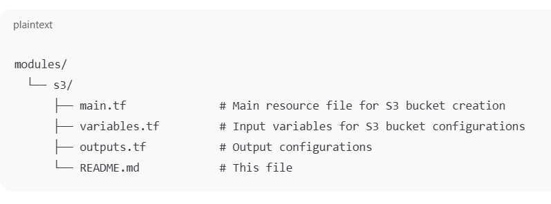
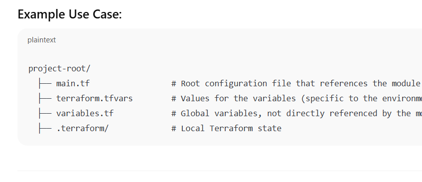
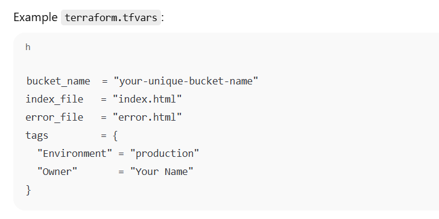

#S3 Bucket Terraform Module
This Terraform module is designed to create an S3 bucket with support for static website hosting. The module also allows for managing various configurations such as tags, ACLs, website settings, and other S3-specific options.

Prerequisites
Before using this module, ensure you have:

Terraform installed on your local machine. Install Terraform

AWS credentials properly set up via AWS CLI or environment variables. AWS Setup

Module Structure
This module is structured to accept inputs for various S3 bucket configurations. The module uses .tfvars files to provide variable values.

Input Variables
The module accepts the following input variables, which can be defined in the terraform.tfvars file.

How to Use
Clone the repository or use the module in your Terraform project.

If you're developing the module locally, navigate to your main project directory and include the module in your Terraform configuration.

Create a terraform.tfvars file:

This file will contain the values for the input variables defined above.

Example terraform.tfvars:

